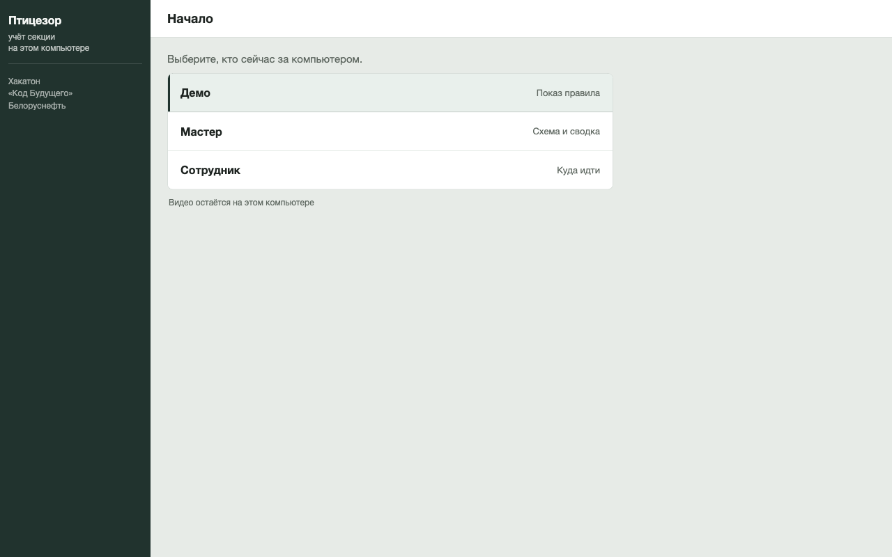
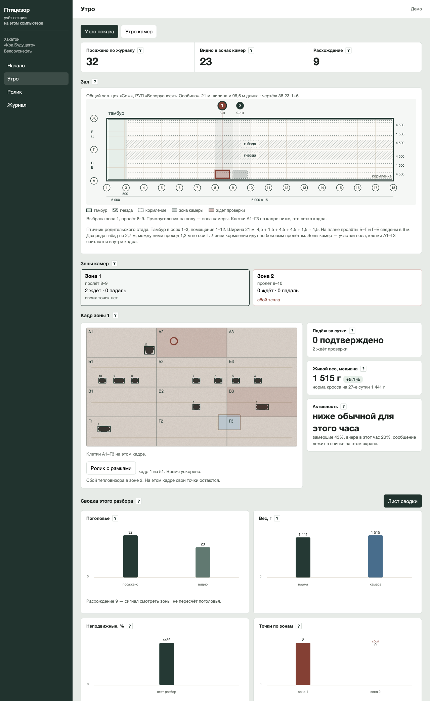
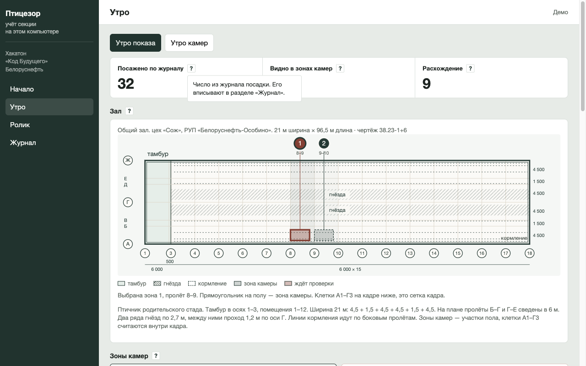
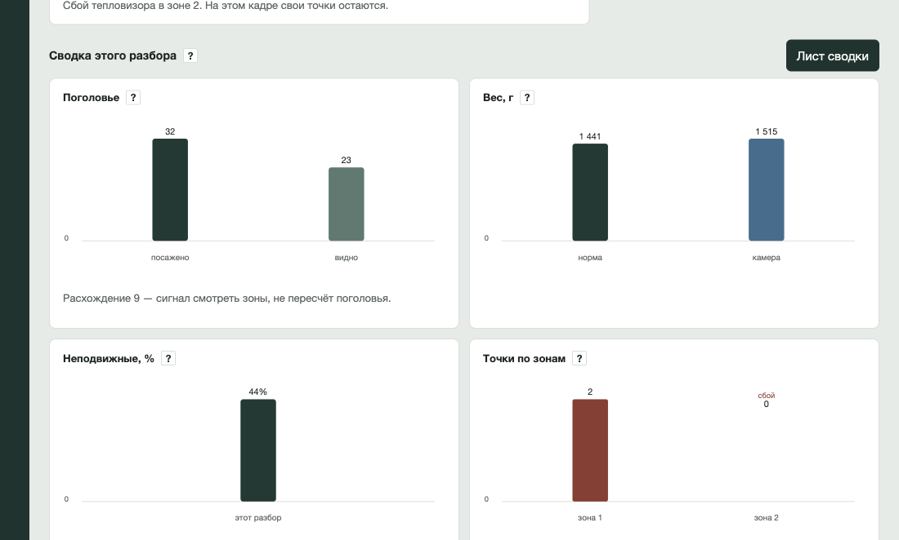
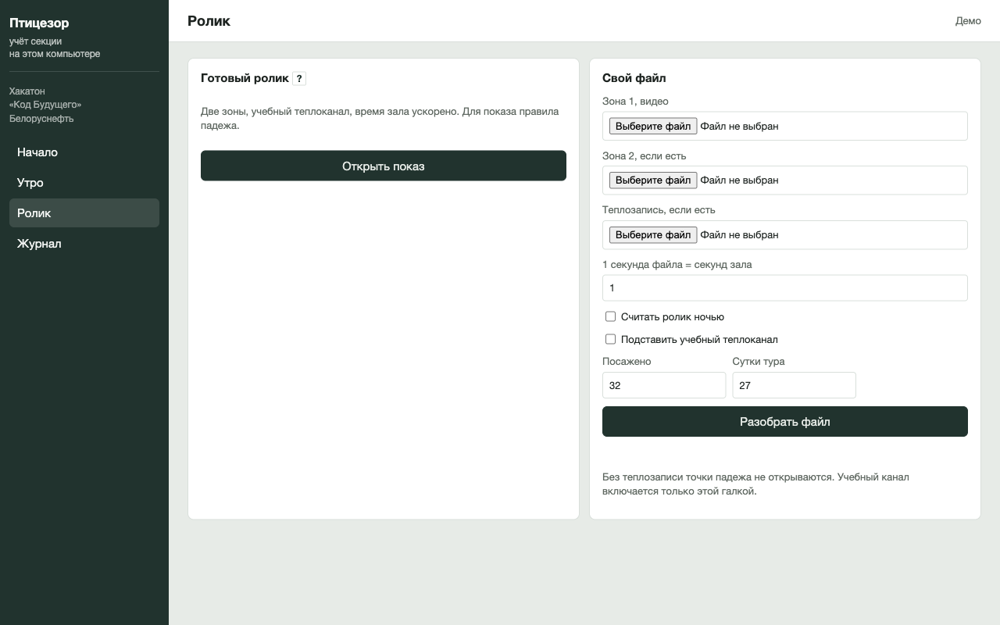
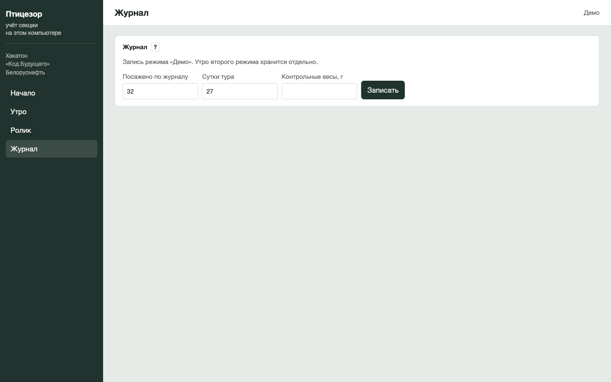
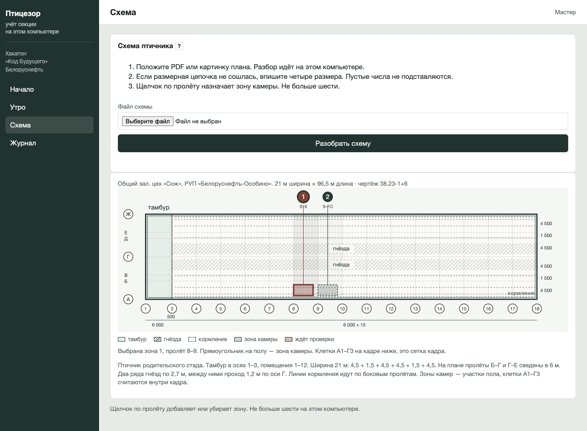
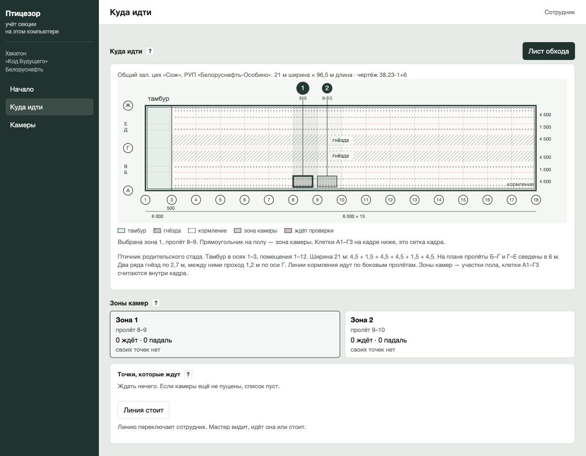
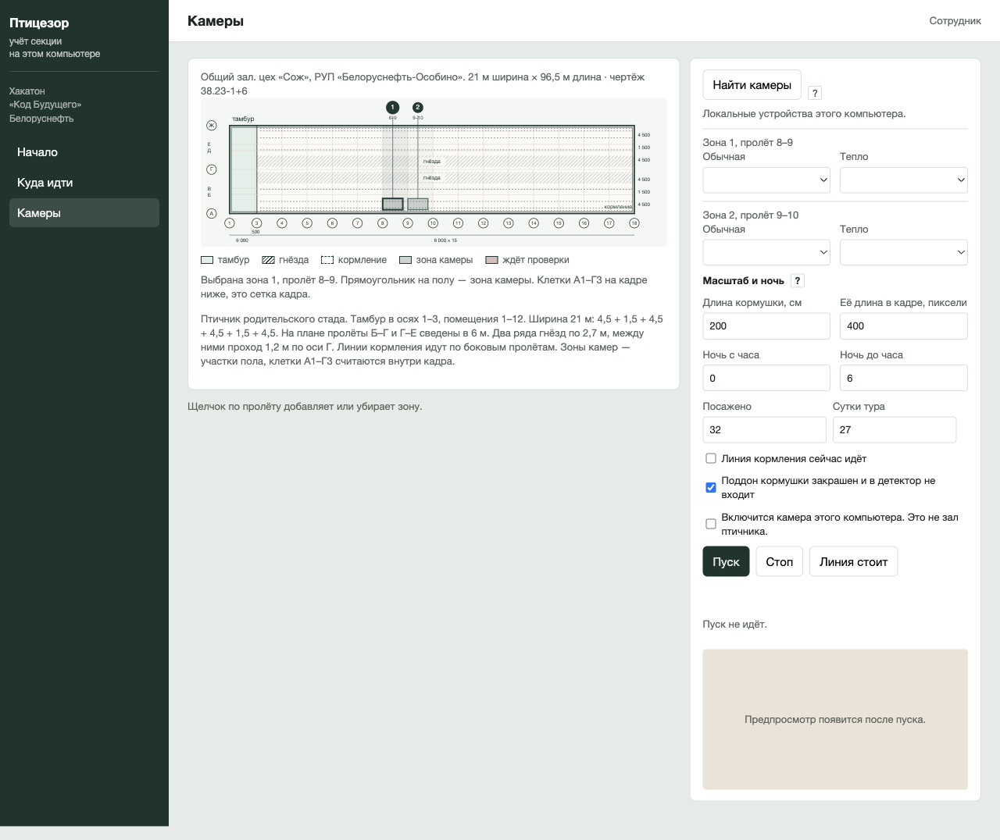

# Птицезор

Автор: [RoomzR](https://github.com/RoomzR), 2026. Страница открыта для проверки заявки на хакатон «Код Будущего». Выдавать программу, снимки и этот текст за свой продукт нельзя. Условия — в файле [LICENSE](LICENSE).

Окно на компьютере для птичника с напольным содержанием бройлера. Обычная камера и тепловизор смотрят сверху на один участок пола. Программа отмечает место, где птица лежит холоднее соседей, считает видимых в зонах камер и оценивает средний вес по рамкам.

Это прототип, не установка в хозяйстве. Пилот не проводился. Цифры на снимках — учебный ролик, не отчёт корпуса.

## Экономический эффект

Пилот не проводился, полученной суммы нет. На экране посажено 32: это ролик, не площадка из счёта.

Одна сохранённая голова в примере: 2,3 кг × 70 % × 7 руб./кг тушки = **11,27 руб.** 7 руб./кг — порядок розничной тушки («Петруха», 7,09 руб./кг), не отпускная цена хозяйства. Найденная падаль в выручку не возвращается: в строке только головы, которых не потеряли дополнительно.

Срез — минус 0,4 процентного пункта к соседней секции (середина вилки 0,3–0,5), шесть туров в год:

| Поголовье | За год, середина | Вилка 0,3–0,5 п.п. |
| --- | --- | --- |
| 20 000 | 5 409,60 руб. | 4 057,20–6 762 руб. |
| 50 000 | 13 524 руб. | 10 143–16 905 руб. |
| 100 000 | 27 048 руб. | 20 286–33 810 руб. |

Проверка: 100 000 × 0,004 = 400 голов; 400 × 11,27 × 6 = 27 048 руб. Если падёж тура около 4 %, на 100 000 голов недополученная выручка порядка **270 тыс. руб. в год**. Срез 0,4 п.п. — десятая часть этой потери. Без соседней секции строку в отчёт не ставят. Вес в рубли не переводится.

Видео с этого компьютера наружу не уходит. Сообщение смене остаётся на экране.

## Стек

Python, FastAPI, OpenCV, scikit-learn, supervision (ByteTrack), pywebview, Pillow. Разбор скана схемы на macOS идёт через Vision. Окно слушает только `127.0.0.1`.

## Запуск

```bash
cd pticezor
python3 -m venv .venv
source .venv/bin/activate
pip install -r requirements.txt
python -m app
```

Тот же запуск — двойной щелчок по `pticezor/Птицезор.command`. Откроется окно «Птицезор».

Проверки из папки `pticezor`:

```bash
pytest
```

Файл `weights/birds.pt` включает рамки обученной модели. Без него готовый ролик считает рамки по контрасту, и об этом написано на экране.

## Роли

На начале выбирают, кто за компьютером. Паролей нет.



| Кто | Что видит | Чего нет |
| --- | --- | --- |
| Демо | Утро, ролик, журнал. Кнопки «падаль» и «живая» есть, чтобы проверить правило. | Схемы и пуска камеры |
| Мастер | Утро, схема, журнал. Отмечает точки. Разбирает чертёж зала. | Пуска камеры |
| Сотрудник | Куда идти, камеры. Включает линию кормления. | Схемы и кнопок падежа |

## Утро

После «Открыть показ» на ролике утро показывает этот разбор, не историю хозяйства.



- **Посажено по журналу** — число из журнала, его вписывают в разделе «Журнал».
- **Видно в зонах камер** — сумма голов, которые попали в зоны, без двойного счёта. Это не инвентаризация корпуса.
- **Расхождение** — сигнал смотреть зоны, не пересчёт поголовья.
- **Вес** — медиана годных рамок и норма кросса на сутки тура. Моложе пяти суток вес не показывают. Контрольные весы вносят рядом, камера их не заменяет.
- **Активность** — доля неподвижных в этот час против того же часа вчера. Сообщение смене лежит в списке на экране.
- Точку «ждёт проверки» мастер отмечает «падаль» или «живая». Тёплая птица на боку точкой не становится. Много холодных пятен и холодный пол — сбой тепловизора, из этого куска точки не ставят.

Знак «?» у цифры, зала и кнопки открывает короткую карточку.



### Графики этого разбора

Четыре карточки относятся только к открытому разбору. Чужие сутки программа не дорисовывает.



1. **Поголовье** — посажено и видно.
2. **Вес** — норма кросса и медиана камеры. Если внесены контрольные весы, они тоже на карточке.
3. **Неподвижные** — доля этого разбора. Второй столбец появляется, когда есть вчерашний тот же час.
4. **Точки по зонам** — ждут проверки и подтверждены. Сбой тепла подписан отдельно и не смешивается с падалью.

«Лист сводки» сохраняет одну страницу PDF на этот компьютер. Окно при этом не закрывается. Отмена ничего не пишет. В листе нет почты и телефона.

## Ролик



«Открыть показ» строит учебный ролик: две зоны, учебный теплоканал, время зала ускорено. Свой файл кладут отдельно. Без теплозаписи точки падежа не открываются. Галка «Подставить учебный теплоканал» включает учебные градусы явно, это не тепловизор зала.

## Журнал



Посажено, сутки тура и контрольные весы. Запись демо и запись камер хранятся отдельно.

## Схема — только у мастера



1. Положить PDF или картинку плана. Разбор идёт на этом компьютере, файл наружу не уходит.
2. Если размерная цепочка не сошлась, вписать четыре размера. Пустые числа программа не подставляет.
3. Щелчок по пролёту назначает зону камеры. Не больше шести.

Пока свой лист не положили, на экране общий зал цеха «Сож», чертёж 38.23-1+6: 21 × 96,5 м, тамбур в осях 1–3, оси А–Ж, два ряда гнёзд по 2,7 м и проход 1,2 м по оси Г. Прямоугольник на полу — зона камеры. Клетки А1–Г3 — сетка кадра, не оси здания.

## Сотрудник

Схемы в меню сотрудника нет. Он видит, куда идти: зона, пролёт, клетка, время. Линию кормления переключает он. Мастер видит, идёт линия или стоит, и сам её не переключает.



«Лист обхода» — PDF без веса: зоны и точки, которые ждут.



«Найти камеры» только перечисляет устройства этого компьютера. «Пуск» требует отметку, что включится камера компьютера и это не зал птичника. «Стоп» гасит картинку и не стирает отметки мастера. Страница камер сама устройство не открывает.

## Чего программа не делает

Не ставит диагноз, не управляет кормом, не звонит и не шлёт сообщения с компьютера. Не обещает точность веса для сдачи партии: документы на сдачу остаются на весах. Не считает весь корпус по двум зонам.
